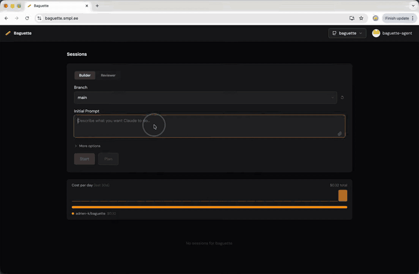

# Baguette 🥖



## What is Baguette?

Baguette is a self-hosted orchestrator for [Claude Code](https://platform.claude.com/docs/en/agent-sdk/typescript) that runs in the cloud, giving you AI-powered coding sessions with GitHub integration, isolated test environments, and the ability to review and merge changes — from any device, including your phone.

- **Runs in the cloud, accessible anywhere** -- Deploy to your own VPS or EC2 instance and develop from any device, including your phone.
- **Tests and dev servers for every session** -- Baguette configures the host to run databases, tests, and whatever else your project needs, isolated per session.
- **Review, merge, and ship without leaving the UI** -- Check your diffs and merge PRs right from Baguette. If you have CI/CD configured, merging deploys straight to production.

**What it isn't:**

- **An isolated environment to run agents** -- Baguette is as secured as editing code with Claude Code having more or less limited access (permission mode) to the shell of the underlying host. The good news is you can run it on a dedicated machine with limited accesses.
- **A multi-tenant platform** -- This is primarily intended for a single user or a close group of builders who don't mind sharing the code (no filesystem isolation) they work on and the machine resources (CPU, memory, database servers, etc.).

## Features

- **GitHub OAuth** -- Sign in with GitHub to create branches and PRs on your behalf.
- **Builder & Reviewer agents** -- Start a Builder session to write code, run tests, and open PRs. Start a Reviewer session on any open PR to analyze changes, post inline comments, and submit a formal review.
- **Session management** -- Spin up Claude sessions from any branch of any repo. Each session gets its own git worktree.
- **Live preview** -- Test your session's changes live in the browser. Each session gets a subdomain hooked to its development server, its own database, and the rest of its isolated stack ([read more](docs/session-management.md#web-server-preview)).
- **Automatic PR creation** -- After Claude's first round of changes, a branch and PR are automatically created with an AI-generated title and description.
- **Task execution** -- Run arbitrary commands within a session's working directory. Tail logs, kill processes, and track running tasks per-session and globally.
- **Permission control** -- Switch between permission modes and interactively approve or deny individual tool calls from the UI.
- **Diff view** -- Browse the session's current git diff with per-file sections and inline/split toggle.
- **File attachments** -- Attach images and files to any chat message.
- **Cost tracking** -- Track session costs on session cards, with a daily chart and usage breakdown per repo.
- **Secrets** -- Inject global secrets into all Claude sessions and tasks via `.baguette.yaml` placeholders.
- **Session config (`.baguette.yaml`)** -- Define per-session env vars, init commands, and cleanup in your repo.
- **User approval** -- First user is auto-approved; subsequent users require approval from an existing user.

## Deploy

- **[Fly.io guide](docs/deployment/fly.io.md)** — Deploy in minutes with auto stop/start machines and pay-per-use billing. No server management required.
- **[Kamal guide (VPS)](docs/deployment/kamal.md)** — Deploy to any Ubuntu VPS (Hetzner, EC2, DigitalOcean, etc.) using [Kamal](https://kamal-deploy.org/). Includes a GitHub Actions workflow for automatic deploys on push to `main`.

## Local development

### Prerequisites

- Node.js 20+
- A [GitHub OAuth App](https://github.com/settings/developers)
- An [Anthropic API key](https://console.anthropic.com/) or a [Claude plan](https://claude.ai/)

### Setup

1. Clone the repository and install dependencies:

```bash
npm install
```

2. Copy the example env file and fill in your credentials:

```bash
cp .env.example .env
```

| Variable               | Description                                                                                                                                                   |
| ---------------------- | ------------------------------------------------------------------------------------------------------------------------------------------------------------- |
| `GITHUB_CLIENT_ID`     | GitHub OAuth App client ID                                                                                                                                    |
| `GITHUB_CLIENT_SECRET` | GitHub OAuth App client secret                                                                                                                                |
| `ENCRYPTION_KEY`       | At least 32 characters; used for cookie signing and for encrypting secrets                                                                                    |
| `PUBLIC_HOST`          | Public base URL of the server (e.g. `https://www.your-domain.com`) (defaults to `http://localhost:3000`, or `http://localhost:5173` if running `npm run dev`) |
| `PORT`                 | Express server port (default: `3000`)                                                                                                                         |
| `DATA_DIR`             | Data directory for DB, repo clones, and worktrees (default: `~/.baguette`)                                                                                    |

3. Set your GitHub OAuth App's callback URL to `http://localhost:5173/auth/github/callback`.

4. Run database migrations:

```bash
npm run migrate
```

5. Install Claude Code:

```bash
curl -fsSL https://claude.ai/install.sh | bash
```

You can either authenticate with Claude Code directly or set an Anthropic Key in **Settings -> Agent**.

### Run

```bash
npm run dev
```

The Vite dev server runs on `http://localhost:5173` and proxies API/WebSocket requests to the Express server on port 3000.

## Tech Stack

- **Backend**: Express, Feathers.js, SQLite (via Knex), Socket.io
- **Frontend**: Vite, React, Tailwind CSS
- **AI**: `@anthropic-ai/claude-agent-sdk`

## Session management

For details on the data directory layout, git worktree strategy, `.baguette.yaml` session config, and web server preview, see **[docs/session-management.md](docs/session-management.md)**.

## Security

For the trust model and secrets handling, see **[docs/security.md](docs/security.md)**.

## Status

Baguette is an early-stage project. Most of the codebase is AI-written and human-reviewed — it works, but expect rough edges. Contributions are welcome; see [CONTRIBUTING.md](CONTRIBUTING.md).

## License

MIT
